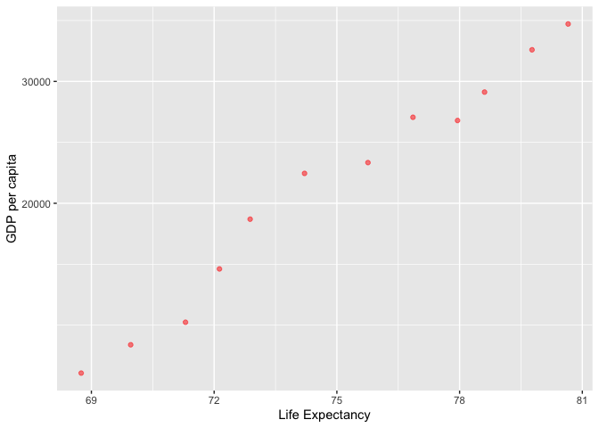
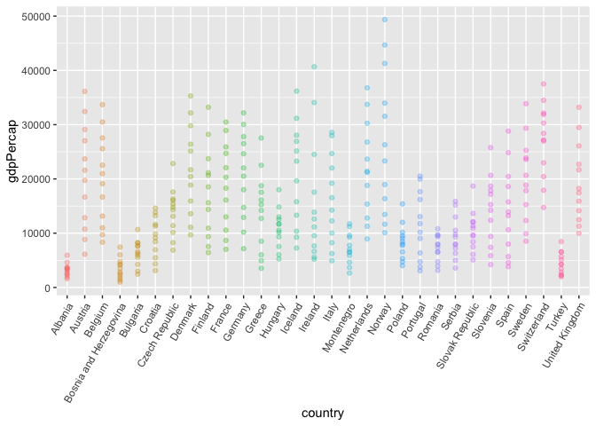
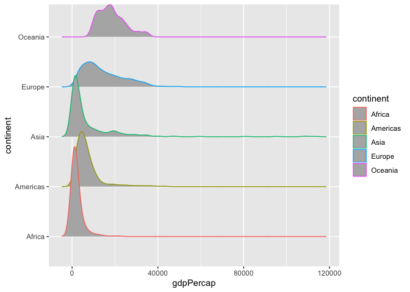
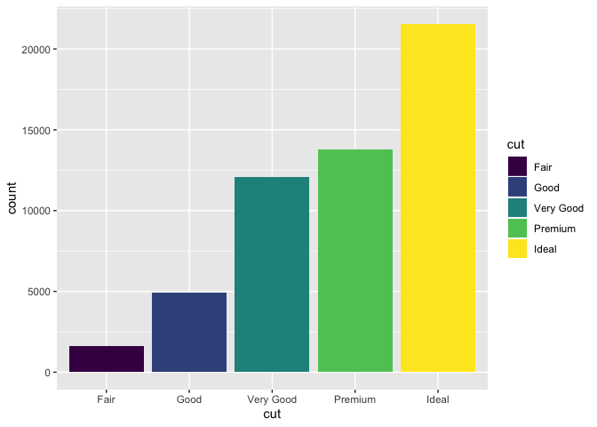
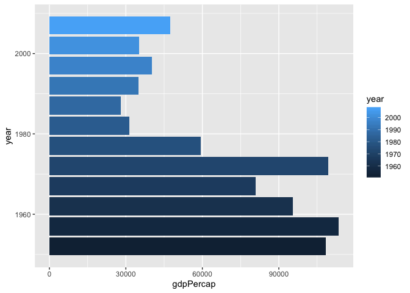
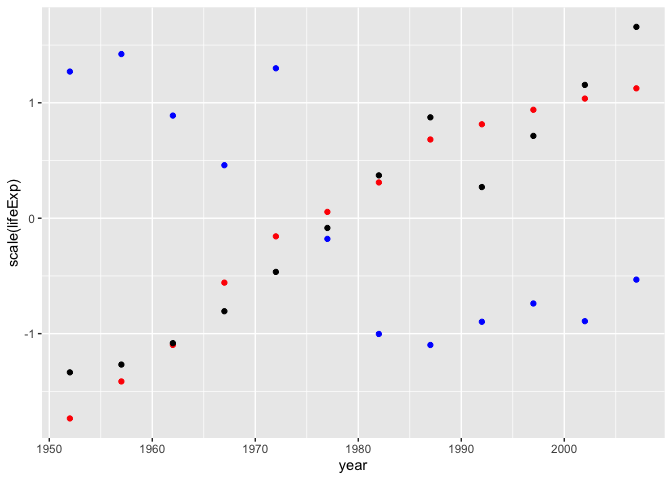
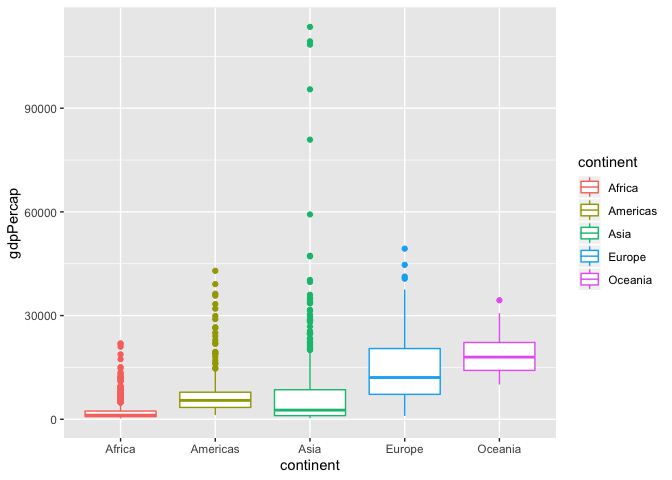

Exploring Gapminder and using `dplyr`
================
Rachel Han
20/09/2019

# Exercise 1: Basic `dplyr`

## Filter

``` r
three_countries <- filter(gapminder, country %in% c("Hong Kong, China","Canada","Korea, Rep."))

three_countries 
```

    ## # A tibble: 36 x 6
    ##    country continent  year lifeExp      pop gdpPercap
    ##    <fct>   <fct>     <int>   <dbl>    <int>     <dbl>
    ##  1 Canada  Americas   1952    68.8 14785584    11367.
    ##  2 Canada  Americas   1957    70.0 17010154    12490.
    ##  3 Canada  Americas   1962    71.3 18985849    13462.
    ##  4 Canada  Americas   1967    72.1 20819767    16077.
    ##  5 Canada  Americas   1972    72.9 22284500    18971.
    ##  6 Canada  Americas   1977    74.2 23796400    22091.
    ##  7 Canada  Americas   1982    75.8 25201900    22899.
    ##  8 Canada  Americas   1987    76.9 26549700    26627.
    ##  9 Canada  Americas   1992    78.0 28523502    26343.
    ## 10 Canada  Americas   1997    78.6 30305843    28955.
    ## # … with 26 more rows

## Pipe

``` r
gdp_dat <- three_countries %>% select(country, gdpPercap)
```

## Countries with a drop in life expectancy

All countries that have experienced a drop in life
expectancy.

``` r
gapminder_lifeExpChange <- gapminder %>%  group_by(country) %>% mutate(lifeExpChange = lifeExp - lag(lifeExp)) %>% drop_na()

gapminder_lifeExpChange %>% filter( lifeExpChange < 0) %>%  select(country,continent,year,lifeExp,lifeExpChange) 
```

    ## # A tibble: 102 x 5
    ## # Groups:   country [142]
    ##    country  continent  year lifeExp lifeExpChange
    ##    <fct>    <fct>     <int>   <dbl>         <dbl>
    ##  1 Albania  Europe     1992    71.6        -0.419
    ##  2 Angola   Africa     1987    39.9        -0.036
    ##  3 Benin    Africa     2002    54.4        -0.371
    ##  4 Botswana Africa     1992    62.7        -0.877
    ##  5 Botswana Africa     1997    52.6       -10.2  
    ##  6 Botswana Africa     2002    46.6        -5.92 
    ##  7 Bulgaria Europe     1977    70.8        -0.09 
    ##  8 Bulgaria Europe     1992    71.2        -0.15 
    ##  9 Bulgaria Europe     1997    70.3        -0.87 
    ## 10 Burundi  Africa     1992    44.7        -3.48 
    ## # … with 92 more rows

## Max GDP per capita

``` r
gapminder %>% group_by(country) %>% mutate(max_gdpPercap = max(gdpPercap)) %>% filter(gdpPercap == max_gdpPercap) %>% select(country,year,max_gdpPercap) 
```

    ## # A tibble: 142 x 3
    ## # Groups:   country [142]
    ##    country      year max_gdpPercap
    ##    <fct>       <int>         <dbl>
    ##  1 Afghanistan  1982          978.
    ##  2 Albania      2007         5937.
    ##  3 Algeria      2007         6223.
    ##  4 Angola       1967         5523.
    ##  5 Argentina    2007        12779.
    ##  6 Australia    2007        34435.
    ##  7 Austria      2007        36126.
    ##  8 Bahrain      2007        29796.
    ##  9 Bangladesh   2007         1391.
    ## 10 Belgium      2007        33693.
    ## # … with 132 more rows

## Canada’s life expectancy vs. GDP per capita

``` r
gapminder %>% filter(country=="Canada") %>% ggplot(aes(lifeExp,gdpPercap)) + geom_point(alpha = 0.5, color="red") + scale_y_log10("GDP per capita") + xlab("Life Expectancy") 
```

<!-- -->

# Exercise 2: Explore inidividual variables with `dplyr`

### Quantitative variable

#### Possible values

``` r
range <-gapminder %>% select(gdpPercap) %>% range()
print(range)
```

    ## [1]    241.1659 113523.1329

``` r
mingdp <- range[1]
maxgdp <- range[2]
```

This tells us that minimum value of gdpPercap is 241.1659 and the
maximum is 113523.1329. Let’s find the corresponding
countries.

``` r
gapminder %>% select(country, year,gdpPercap) %>% filter(gdpPercap == mingdp) %>% kable()
```

| country          | year | gdpPercap |
| :--------------- | ---: | --------: |
| Congo, Dem. Rep. | 2002 |  241.1659 |

Congo is the country that recorded the minimum
gdpPercap.

``` r
gapminder %>% select(country, year,gdpPercap) %>% filter(gdpPercap == maxgdp) %>% kable()
```

| country | year | gdpPercap |
| :------ | ---: | --------: |
| Kuwait  | 1957 |  113523.1 |

Kuwait is the country that recorded the maximum gdpPercap.

#### Typical values / Spread of data / Distribution

Let’s get a statistical summary of life expectancy, populartion and gdp
per capita for
Europe:

``` r
gapminder %>%filter(continent=="Europe") %>% select(lifeExp,pop,gdpPercap) %>% summary()
```

    ##     lifeExp           pop             gdpPercap      
    ##  Min.   :43.59   Min.   :  147962   Min.   :  973.5  
    ##  1st Qu.:69.57   1st Qu.: 4331500   1st Qu.: 7213.1  
    ##  Median :72.24   Median : 8551125   Median :12081.8  
    ##  Mean   :71.90   Mean   :17169765   Mean   :14469.5  
    ##  3rd Qu.:75.45   3rd Qu.:21802867   3rd Qu.:20461.4  
    ##  Max.   :81.76   Max.   :82400996   Max.   :49357.2

The distribution of gdpPercap across all the countries in
Europe:

``` r
gapminder %>% filter(continent=="Europe") %>% ggplot(aes(country,gdpPercap, color = country)) + geom_point(alpha=0.3) + theme(axis.text.x = element_text(angle = 60, hjust = 1)) + theme(legend.position = "none")
```

<!-- -->

The following plots the density estimates of gdp per capita for each
continent (estimates the underlying distribution of the data).

``` r
ggplot(gapminder, aes(gdpPercap, continent, color = continent)) +
  ggridges::geom_density_ridges(bins = 50)
```

    ## Picking joint bandwidth of 1650

<!-- -->

### Categorical variable

``` r
library(datasets)
```

We will use a different data set to explore a categorical variable.
Let’s explore cut variable

``` r
diamonds <- as_tibble(diamonds)
```

#### Possible values of the variable

``` r
cut_unique <- diamonds %>% select(cut) %>% unique()
cut_unique %>% kable()
```

| cut       |
| :-------- |
| Ideal     |
| Premium   |
| Good      |
| Very Good |
| Fair      |

#### Typical values / Spread of data / Distribution

``` r
diamonds %>% count(cut) %>% kable()
```

| cut       |     n |
| :-------- | ----: |
| Fair      |  1610 |
| Good      |  4906 |
| Very Good | 12082 |
| Premium   | 13791 |
| Ideal     | 21551 |

We can plot this count data:

``` r
diamonds %>%  ggplot(aes(cut,fill = cut)) + geom_bar() 
```

<!-- -->

We see that a ‘fair’ cut diamond is very rare, and ‘ideal’ cut is the
most common one.

## More plots

Exploring the country with biggest drop in 10 years and plot it over the
years.

``` r
gapminder %>% group_by(country) %>% arrange(year) %>% mutate(dec_gdpPercap=difference(gdpPercap,2)) %>% drop_na() %>% ungroup() %>%  group_by(continent) %>% filter(dec_gdpPercap == min(dec_gdpPercap)) %>% select(country,continent,year,gdpPercap,dec_gdpPercap) %>% arrange(dec_gdpPercap) %>% kable()
```

| country     | continent | year | gdpPercap | dec\_gdpPercap |
| :---------- | :-------- | ---: | --------: | -------------: |
| Kuwait      | Asia      | 1982 | 31354.036 |   \-77993.8313 |
| Libya       | Africa    | 1987 | 11770.590 |   \-10180.6220 |
| Serbia      | Europe    | 1997 |  7914.320 |    \-7956.5582 |
| Venezuela   | Americas  | 1987 |  9883.585 |    \-3260.3663 |
| New Zealand | Oceania   | 1992 | 18363.325 |       730.9145 |

Kuwait recorded the biggest drop of GDP in 10 years. Let’s see what
happened over the years in
Kuwait.

``` r
gapminder %>% filter(country=="Kuwait") %>% ggplot(aes(year, gdpPercap,fill=year)) + geom_col(stat="identity") + coord_flip()
```

    ## Warning: Ignoring unknown parameters: stat

<!-- --> There
seemed to have been a huge boom around 1960’s but in the 2000’s it
dratically decreased. Could there have been some other factors that came
into
play?

``` r
gapminder %>% filter(country=="Kuwait") %>% ggplot(aes(x = year)) + geom_point(aes(y=scale(lifeExp)), color = "red") +  geom_point(aes(y=scale(pop))) + geom_point(aes(y=scale(gdpPercap)), color="blue") 
```

<!-- -->

It seems as though gdp per capita has an inverse relationship with the
population and life expectancy in
Kuwait.

``` r
gapminder %>% ggplot(aes(continent,gdpPercap, color = continent)) + geom_boxplot() 
```

<!-- -->

We see that Asia has the most fluctuations in gdpPercap.

# Reasoning

``` r
filter(gapminder, country == c("Rwanda", "Afghanistan"))
```

    ## # A tibble: 12 x 6
    ##    country     continent  year lifeExp      pop gdpPercap
    ##    <fct>       <fct>     <int>   <dbl>    <int>     <dbl>
    ##  1 Afghanistan Asia       1957    30.3  9240934      821.
    ##  2 Afghanistan Asia       1967    34.0 11537966      836.
    ##  3 Afghanistan Asia       1977    38.4 14880372      786.
    ##  4 Afghanistan Asia       1987    40.8 13867957      852.
    ##  5 Afghanistan Asia       1997    41.8 22227415      635.
    ##  6 Afghanistan Asia       2007    43.8 31889923      975.
    ##  7 Rwanda      Africa     1952    40    2534927      493.
    ##  8 Rwanda      Africa     1962    43    3051242      597.
    ##  9 Rwanda      Africa     1972    44.6  3992121      591.
    ## 10 Rwanda      Africa     1982    46.2  5507565      882.
    ## 11 Rwanda      Africa     1992    23.6  7290203      737.
    ## 12 Rwanda      Africa     2002    43.4  7852401      786.

This code runs fine but the result returned is off in the sense that it
is missing half of its entries (the entries for every five years is
missing). The correct way to do this is:

``` r
gapminder %>% filter(country %in% c("Afghanistan","Rwanda"))
```

    ## # A tibble: 24 x 6
    ##    country     continent  year lifeExp      pop gdpPercap
    ##    <fct>       <fct>     <int>   <dbl>    <int>     <dbl>
    ##  1 Afghanistan Asia       1952    28.8  8425333      779.
    ##  2 Afghanistan Asia       1957    30.3  9240934      821.
    ##  3 Afghanistan Asia       1962    32.0 10267083      853.
    ##  4 Afghanistan Asia       1967    34.0 11537966      836.
    ##  5 Afghanistan Asia       1972    36.1 13079460      740.
    ##  6 Afghanistan Asia       1977    38.4 14880372      786.
    ##  7 Afghanistan Asia       1982    39.9 12881816      978.
    ##  8 Afghanistan Asia       1987    40.8 13867957      852.
    ##  9 Afghanistan Asia       1992    41.7 16317921      649.
    ## 10 Afghanistan Asia       1997    41.8 22227415      635.
    ## # … with 14 more rows

`%in` checks if an element is in the vector whereas `==` checks if it is
exactly the same as the specified value. By using `%in` in checks if
each entry is in the specified vector `c("Afghanistan","Rwanda")`. Using
`==` actually checks if each entry is equal to
`c("Afghanistan","Rwanda")` which is not what we want.
