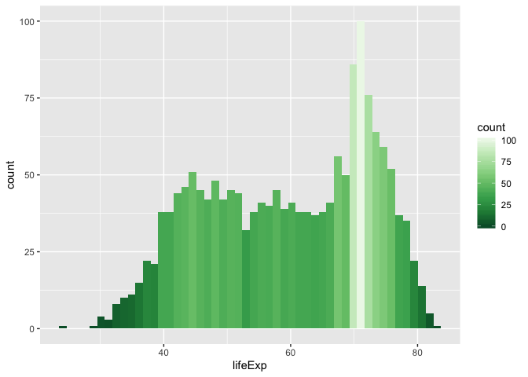
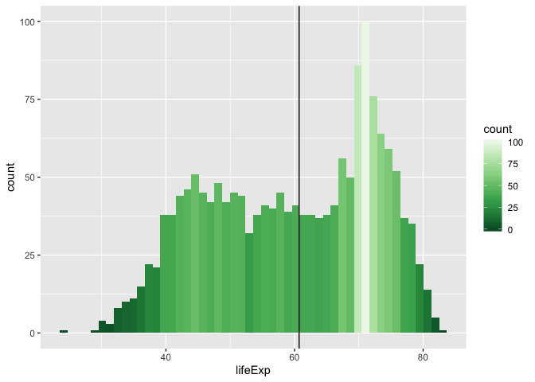
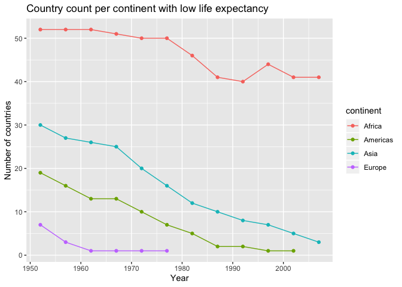
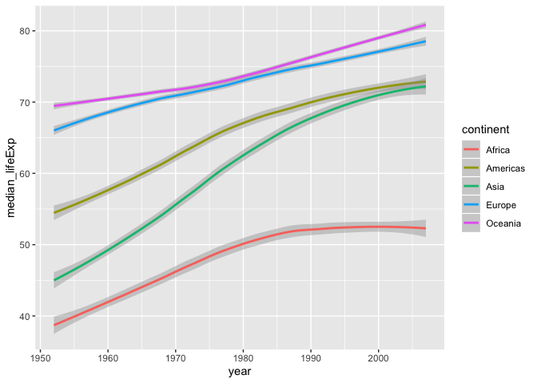
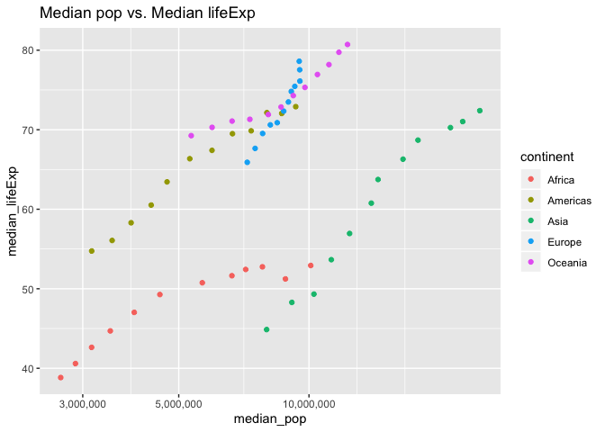
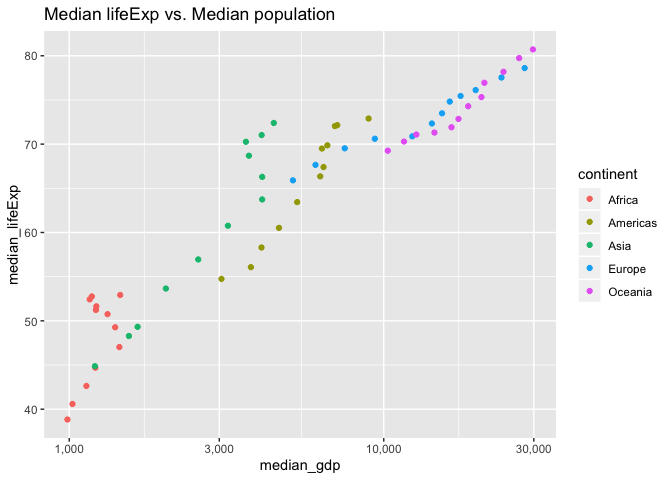
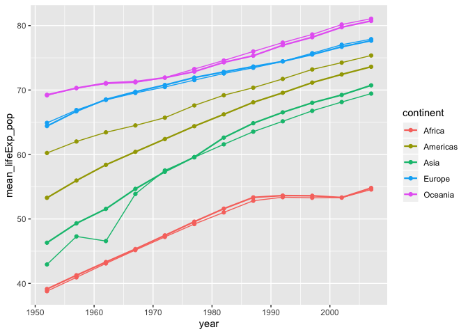

# Exploring Life Expectancies Globally

Let's examine the distribution of life expectancy across all countries.

```r
gapminder %>%
  ggplot(aes(lifeExp, color = lifeExp)) +
  geom_histogram(bins = 50, aes(fill=..count..)) +
  scale_fill_distiller(palette = "Greens")
```

<!-- -->

Here is a worldwide statistics about life expectancy:


```r
gapminder %>% select(lifeExp, year) %>%
  summarise(median_lifeExp = median(lifeExp),
            mean_lifeExp = mean(lifeExp)) %>% kable
```


 median_lifeExp   mean_lifeExp
---------------  -------------
        60.7125       59.47444

- The table above shows the median and the mean life expectancy across all the countries in `gapminder`. Being optimistic, let's pick the median life expectancy,`median_lifeExp = 60.7125`, as a global standard. 
- The black vertical line on the histogram denotes the global standard.

```r
gapminder %>%
  ggplot(aes(lifeExp, color = lifeExp)) +
  geom_histogram(bins = 50, aes(fill=..count..)) +
  scale_fill_distiller(palette = "Greens") +
  geom_vline(aes(xintercept = median(lifeExp)))
```

<!-- -->

- Now, let's find the countries that have life expectancies that are below this global standard.

```r
p <- gapminder %>%
  select(country, continent, year, lifeExp) %>%
  filter(lifeExp < median(lifeExp)) %>% 
  group_by(continent, year) %>% 
  summarise(count_countries=n())
(p)
```

```
## # A tibble: 41 x 3
## # Groups:   continent [4]
##    continent  year count_countries
##    <fct>     <int>           <int>
##  1 Africa     1952              52
##  2 Africa     1957              52
##  3 Africa     1962              52
##  4 Africa     1967              51
##  5 Africa     1972              50
##  6 Africa     1977              50
##  7 Africa     1982              46
##  8 Africa     1987              41
##  9 Africa     1992              40
## 10 Africa     1997              44
## # … with 31 more rows
```

Notice Oceania is not here. Why?


```r
gapminder %>% filter(continent == "Oceania") %>%
  select(country,year,lifeExp,pop) %>% 
  filter(lifeExp == min(lifeExp)) %>% kable
```


country      year   lifeExp       pop
----------  -----  --------  --------
Australia    1952     69.12   8691212


The minimum life expectancy recorded is 69.12 in Australia in 1952, which is higher than the global standard.

## Life Expectancy by Continent


```r
p %>% ggplot(aes(x=year, y = count_countries,group = continent, color = continent)) + geom_line() + geom_point() + ylab("Number of countries") + xlab("Year") + ggtitle("Country count per continent with low life expectancy")
```

<!-- -->

- Comparing against the global standard (median life expectancy), we see that Africa had the highest count of countries with early death across all times. 
- For Asia, the count decreases rapidly over time.
- Oceania is left out of the graph as no countries are below the median.

# Continent-wise Life Expectancy Trend


```r
gapminder %>%
  select(country, continent, year, lifeExp, pop) %>%
  group_by(continent,year) %>%
  summarise(median_lifeExp=median(lifeExp),
            sum_pop =sum(as.numeric(pop))) %>% 
  ggplot(aes(year,median_lifeExp, color = continent))+
  geom_smooth(aes(group=continent)) 
```

```
## `geom_smooth()` using method = 'loess' and formula 'y ~ x'
```

<!-- -->

We can see that over time, the life expectancy generally goes up. The slowest increase of life expectancy is observed in Europe and Oceania. The fastest rise is in Asia. For Africa, we see that during mid 1980's to 2000, the slope is levelling to a constant.

# Correlations

Could there be a correlation between life expectancy, and population? Below, we plot the the median population versus median life expectancy over time per continent.

We see that in general, as population increases, the life expectancy increases.


```r
gapminder %>%
  select(country, continent, year, lifeExp, pop) %>%
  group_by(continent,year) %>%
  summarise(median_lifeExp=median(lifeExp),
            median_pop =median(as.numeric(pop))) %>% 
  ggplot(aes(median_pop,median_lifeExp, color = continent)) +   geom_point(aes(group=continent)) + scale_x_log10(labels = comma_format()) + ggtitle("Median pop vs. Median lifeExp") 
```

<!-- -->

We also plot the median GDP per capita versus the median expectancy. We also see that there is an increasing trend.


```r
gapminder %>%
  select(country, continent, year, lifeExp, gdpPercap) %>%
  group_by(continent,year) %>%
  summarise(median_lifeExp=median(lifeExp),
            median_gdp =median(gdpPercap)) %>% 
  ggplot(aes(median_gdp,median_lifeExp, color = continent)) +   geom_point(aes(group=continent)) + scale_x_log10(labels = comma_format()) + ggtitle("Median lifeExp vs. Median population") 
```

<!-- -->

I will not draw any qualitative interpretations from this data, more statistical analysis should be done in order to do so.


# Weighted mean of life expectancy, by population

```r
gapminder %>% group_by(continent,year) %>%
  summarise(vanilla_mean = mean(lifeExp),
            mean_lifeExp_pop = weighted.mean(lifeExp,pop))
```

```
## # A tibble: 60 x 4
## # Groups:   continent [5]
##    continent  year vanilla_mean mean_lifeExp_pop
##    <fct>     <int>        <dbl>            <dbl>
##  1 Africa     1952         39.1             38.8
##  2 Africa     1957         41.3             40.9
##  3 Africa     1962         43.3             43.1
##  4 Africa     1967         45.3             45.2
##  5 Africa     1972         47.5             47.2
##  6 Africa     1977         49.6             49.2
##  7 Africa     1982         51.6             51.0
##  8 Africa     1987         53.3             52.8
##  9 Africa     1992         53.6             53.4
## 10 Africa     1997         53.6             53.3
## # … with 50 more rows
```

- `mean_lifeExp_pop` represents the mean of life expectancy weighted by population. This means that the life expectancy data with bigger population gets a higher weight than those with smaller population. 

Here is a plot of the vanilla mean and the weighted mean. The thinner plot denotes the vanilla mean.


```r
gapminder %>% group_by(continent, year) %>%
  summarise(vanilla_mean = mean(lifeExp),
            mean_lifeExp_pop = weighted.mean(lifeExp,pop)) %>% ggplot(aes(year,mean_lifeExp_pop,
              color = continent)) +
  geom_line(aes(group= continent)) +
  geom_point(aes(year,mean_lifeExp_pop,
                 group = continent)) +
  geom_line(aes(year,vanilla_mean), size = 0.8) +
  geom_point(aes(year,vanilla_mean,
                 group = continent))
```

<!-- -->


