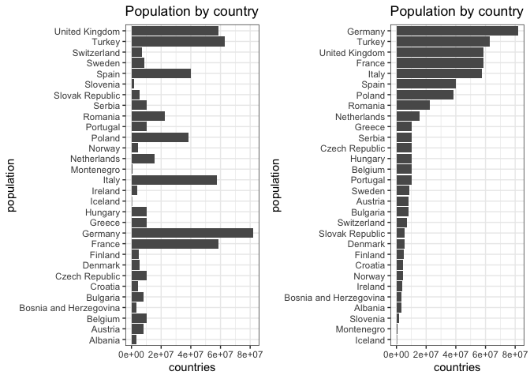
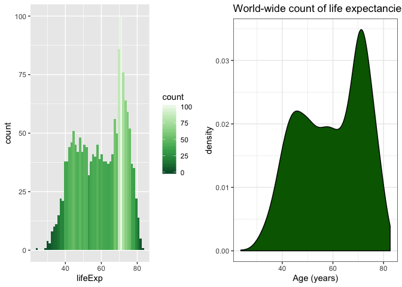

# Exercise 1

The `here()` command tells you the root directory of your R project. You can use this to locate to the directory you want from your root directory, by something like:

`here("directory_you_want_parent","directory_you_want1")`. 

The advantage of `here()` over relative path is that it does not matter in which directory you are working at, whether you are in the root directory or at a child directory.

This makes calling functions/reading/writing/ from other directories easier since you won't have to do something like:

`read_csv(../../directory_you_want1/dat.csv)`,

but can do 

`read_csv(here(directory_you_want_parent/directory_you_want1/dat.csv))`.

This function is robust in this sense that as long as you are working within the root project directory and know the path you want, you can access in a consistent way.

# Exercise 2

## Drop factor / levels;

Before dropping `Oceania` continent, we first check if `contient` is a factor. 


```r
# check the class of continent
(gapminder$continent %>% 
  class() )
```

```
## [1] "factor"
```

```r
# how many levels?
(gapminder$continent %>% 
   nlevels())
```

```
## [1] 5
```

```r
# levels?
(gapminder$continent %>% 
   levels()) 
```

```
## [1] "Africa"   "Americas" "Asia"     "Europe"   "Oceania"
```

We now drop `Oceania` and unnecessary factor levels.


```r
filter_gap <- gapminder %>%
  filter(continent != "Oceania")

gap <- filter_gap %>%
  droplevels() 
```

Now after dropping `Oceania` we check that the of levels is decreased, and check the levels.

```r
gap$continent %>%
  nlevels
```

```
## [1] 4
```

```r
gap$continent %>% 
  levels
```

```
## [1] "Africa"   "Americas" "Asia"     "Europe"
```

## Reorder levels based on knowledge from data.


**`arrange` on original factor vs. releveled factor.**

Let's `arrange` on the country. Default order follows the alphabetical order of the countries. Let's only look at data in 1997.


```r
gap_1997 <-gap %>% 
   filter(year=="1997")

(arr_gap <- gap_1997 %>% 
  arrange(country)) %>% datatable()
```

<!--html_preserve--><div id="htmlwidget-69ffbda1977505d43644" style="width:100%;height:auto;" class="datatables html-widget"></div>
<script type="application/json" data-for="htmlwidget-69ffbda1977505d43644">{"x":{"filter":"none","data":[["1","2","3","4","5","6","7","8","9","10","11","12","13","14","15","16","17","18","19","20","21","22","23","24","25","26","27","28","29","30","31","32","33","34","35","36","37","38","39","40","41","42","43","44","45","46","47","48","49","50","51","52","53","54","55","56","57","58","59","60","61","62","63","64","65","66","67","68","69","70","71","72","73","74","75","76","77","78","79","80","81","82","83","84","85","86","87","88","89","90","91","92","93","94","95","96","97","98","99","100","101","102","103","104","105","106","107","108","109","110","111","112","113","114","115","116","117","118","119","120","121","122","123","124","125","126","127","128","129","130","131","132","133","134","135","136","137","138","139","140"],["Afghanistan","Albania","Algeria","Angola","Argentina","Austria","Bahrain","Bangladesh","Belgium","Benin","Bolivia","Bosnia and Herzegovina","Botswana","Brazil","Bulgaria","Burkina Faso","Burundi","Cambodia","Cameroon","Canada","Central African Republic","Chad","Chile","China","Colombia","Comoros","Congo, Dem. Rep.","Congo, Rep.","Costa Rica","Cote d'Ivoire","Croatia","Cuba","Czech Republic","Denmark","Djibouti","Dominican Republic","Ecuador","Egypt","El Salvador","Equatorial Guinea","Eritrea","Ethiopia","Finland","France","Gabon","Gambia","Germany","Ghana","Greece","Guatemala","Guinea","Guinea-Bissau","Haiti","Honduras","Hong Kong, China","Hungary","Iceland","India","Indonesia","Iran","Iraq","Ireland","Israel","Italy","Jamaica","Japan","Jordan","Kenya","Korea, Dem. Rep.","Korea, Rep.","Kuwait","Lebanon","Lesotho","Liberia","Libya","Madagascar","Malawi","Malaysia","Mali","Mauritania","Mauritius","Mexico","Mongolia","Montenegro","Morocco","Mozambique","Myanmar","Namibia","Nepal","Netherlands","Nicaragua","Niger","Nigeria","Norway","Oman","Pakistan","Panama","Paraguay","Peru","Philippines","Poland","Portugal","Puerto Rico","Reunion","Romania","Rwanda","Sao Tome and Principe","Saudi Arabia","Senegal","Serbia","Sierra Leone","Singapore","Slovak Republic","Slovenia","Somalia","South Africa","Spain","Sri Lanka","Sudan","Swaziland","Sweden","Switzerland","Syria","Taiwan","Tanzania","Thailand","Togo","Trinidad and Tobago","Tunisia","Turkey","Uganda","United Kingdom","United States","Uruguay","Venezuela","Vietnam","West Bank and Gaza","Yemen, Rep.","Zambia","Zimbabwe"],["Asia","Europe","Africa","Africa","Americas","Europe","Asia","Asia","Europe","Africa","Americas","Europe","Africa","Americas","Europe","Africa","Africa","Asia","Africa","Americas","Africa","Africa","Americas","Asia","Americas","Africa","Africa","Africa","Americas","Africa","Europe","Americas","Europe","Europe","Africa","Americas","Americas","Africa","Americas","Africa","Africa","Africa","Europe","Europe","Africa","Africa","Europe","Africa","Europe","Americas","Africa","Africa","Americas","Americas","Asia","Europe","Europe","Asia","Asia","Asia","Asia","Europe","Asia","Europe","Americas","Asia","Asia","Africa","Asia","Asia","Asia","Asia","Africa","Africa","Africa","Africa","Africa","Asia","Africa","Africa","Africa","Americas","Asia","Europe","Africa","Africa","Asia","Africa","Asia","Europe","Americas","Africa","Africa","Europe","Asia","Asia","Americas","Americas","Americas","Asia","Europe","Europe","Americas","Africa","Europe","Africa","Africa","Asia","Africa","Europe","Africa","Asia","Europe","Europe","Africa","Africa","Europe","Asia","Africa","Africa","Europe","Europe","Asia","Asia","Africa","Asia","Africa","Americas","Africa","Europe","Africa","Europe","Americas","Americas","Americas","Asia","Asia","Asia","Africa","Africa"],[1997,1997,1997,1997,1997,1997,1997,1997,1997,1997,1997,1997,1997,1997,1997,1997,1997,1997,1997,1997,1997,1997,1997,1997,1997,1997,1997,1997,1997,1997,1997,1997,1997,1997,1997,1997,1997,1997,1997,1997,1997,1997,1997,1997,1997,1997,1997,1997,1997,1997,1997,1997,1997,1997,1997,1997,1997,1997,1997,1997,1997,1997,1997,1997,1997,1997,1997,1997,1997,1997,1997,1997,1997,1997,1997,1997,1997,1997,1997,1997,1997,1997,1997,1997,1997,1997,1997,1997,1997,1997,1997,1997,1997,1997,1997,1997,1997,1997,1997,1997,1997,1997,1997,1997,1997,1997,1997,1997,1997,1997,1997,1997,1997,1997,1997,1997,1997,1997,1997,1997,1997,1997,1997,1997,1997,1997,1997,1997,1997,1997,1997,1997,1997,1997,1997,1997,1997,1997,1997,1997],[41.763,72.95,69.152,40.963,73.275,77.51,73.925,59.412,77.53,54.777,62.05,73.244,52.556,69.388,70.32,50.324,45.326,56.534,52.199,78.61,46.066,51.573,75.816,70.426,70.313,60.66,42.587,52.962,77.26,47.991,73.68,76.151,74.01,76.11,53.157,69.957,72.312,67.217,69.535,48.245,53.378,49.402,77.13,78.64,60.461,55.861,77.34,58.556,77.869,66.322,51.455,44.873,56.671,67.659,80,71.04,78.95,61.765,66.041,68.042,58.811,76.122,78.269,78.82,72.262,80.69,69.772,54.407,67.727,74.647,76.156,70.265,55.558,42.221,71.555,54.978,47.495,71.938,49.903,60.43,70.736,73.67,63.625,75.445,67.66,46.344,60.328,58.909,59.426,78.03,68.426,51.313,47.464,78.32,72.499,61.818,73.738,69.4,68.386,68.564,72.75,75.97,74.917,74.772,69.72,36.087,63.306,70.533,60.187,72.232,39.897,77.158,72.71,75.13,43.795,60.236,78.77,70.457,55.373,54.289,79.39,79.37,71.527,75.25,48.466,67.521,58.39,69.465,71.973,68.835,44.578,77.218,76.81,74.223,72.146,70.672,71.096,58.02,40.238,46.809],[22227415,3428038,29072015,9875024,36203463,8069876,598561,123315288,10199787,6066080,7693188,3607000,1536536,168546719,8066057,10352843,6121610,11782962,14195809,30305843,3696513,7562011,14599929,1230075000,37657830,527982,47798986,2800947,3518107,14625967,4444595,10983007,10300707,5283663,417908,7992357,11911819,66134291,5783439,439971,4058319,59861301,5134406,58623428,1126189,1235767,82011073,18418288,10502372,9803875,8048834,1193708,6913545,5867957,6495918,10244684,271192,959000000,199278000,63327987,20775703,3667233,5531387,57479469,2531311,125956499,4526235,28263827,21585105,46173816,1765345,3430388,1982823,2200725,4759670,14165114,10419991,20476091,9384984,2444741,1149818,95895146,2494803,692651,28529501,16603334,43247867,1774766,23001113,15604464,4609572,9666252,106207839,4405672,2283635,135564834,2734531,5154123,24748122,75012988,38654957,10156415,3759430,684810,22562458,7212583,145608,21229759,9535314,10336594,4578212,3802309,5383010,2011612,6633514,42835005,39855442,18698655,32160729,1054486,8897619,7193761,15081016,21628605,30686889,60216677,4320890,1138101,9231669,63047647,21210254,58808266,272911760,3262838,22374398,76048996,2826046,15826497,9417789,11404948],[635.341351,3193.054604,4797.295051,2277.140884,10967.28195,29095.92066,20292.01679,972.7700352,27561.19663,1232.975292,3326.143191,4766.355904,8647.142313,7957.980824,5970.38876,946.2949618,463.1151478,734.28517,1694.337469,28954.92589,740.5063317,1004.961353,10118.05318,2289.234136,6117.361746,1173.618235,312.188423,3484.164376,6677.045314,1786.265407,9875.604515,5431.990415,16048.51424,29804.34567,1895.016984,3614.101285,7429.455877,4173.181797,5154.825496,2814.480755,913.47079,515.8894013,23723.9502,25889.78487,14722.84188,653.7301704,27788.88416,1005.245812,18747.69814,4684.313807,869.4497668,796.6644681,1341.726931,3160.454906,28377.63219,11712.7768,28061.09966,1458.817442,3119.335603,8263.590301,3076.239795,24521.94713,20896.60924,24675.02446,7121.924704,28816.58499,3645.379572,1360.485021,1690.756814,15993.52796,40300.61996,8754.96385,1186.147994,609.1739508,9467.446056,986.2958956,692.2758103,10132.90964,790.2579846,1483.136136,7425.705295,9767.29753,1902.2521,6465.613349,2982.101858,472.3460771,415,3899.52426,1010.892138,30246.13063,2253.023004,580.3052092,1624.941275,41283.16433,19702.05581,2049.350521,7113.692252,4247.400261,5838.347657,2536.534925,10159.58368,17641.03156,16999.4333,6071.941411,7346.547557,589.9445051,1339.076036,20586.69019,1392.368347,7914.320304,574.6481576,33519.4766,12126.23065,17161.10735,930.5964284,7479.188244,20445.29896,2664.477257,1632.210764,3876.76846,25266.59499,32135.32301,4014.238972,20206.82098,789.1862231,5852.625497,982.2869243,8792.573126,4876.798614,6601.429915,816.559081,26074.53136,35767.43303,9230.240708,10165.49518,1385.896769,7110.667619,2117.484526,1071.353818,792.4499603]],"container":"<table class=\"display\">\n  <thead>\n    <tr>\n      <th> <\/th>\n      <th>country<\/th>\n      <th>continent<\/th>\n      <th>year<\/th>\n      <th>lifeExp<\/th>\n      <th>pop<\/th>\n      <th>gdpPercap<\/th>\n    <\/tr>\n  <\/thead>\n<\/table>","options":{"columnDefs":[{"className":"dt-right","targets":[3,4,5,6]},{"orderable":false,"targets":0}],"order":[],"autoWidth":false,"orderClasses":false}},"evals":[],"jsHooks":[]}</script><!--/html_preserve-->


We will reorder the countries in the order of population (taking the maximum population recorded).


```r
# reordered `country` according to population
relevel_country<-
  fct_reorder(gap_1997$country,
              gap_1997$pop,max,
              .incr=TRUE) 
```


```r
(arr_re_gap <- gap_1997 %>%
  arrange(relevel_country)) %>%
  datatable()
```

<!--html_preserve--><div id="htmlwidget-66976b06144e41e0819c" style="width:100%;height:auto;" class="datatables html-widget"></div>
<script type="application/json" data-for="htmlwidget-66976b06144e41e0819c">{"x":{"filter":"none","data":[["1","2","3","4","5","6","7","8","9","10","11","12","13","14","15","16","17","18","19","20","21","22","23","24","25","26","27","28","29","30","31","32","33","34","35","36","37","38","39","40","41","42","43","44","45","46","47","48","49","50","51","52","53","54","55","56","57","58","59","60","61","62","63","64","65","66","67","68","69","70","71","72","73","74","75","76","77","78","79","80","81","82","83","84","85","86","87","88","89","90","91","92","93","94","95","96","97","98","99","100","101","102","103","104","105","106","107","108","109","110","111","112","113","114","115","116","117","118","119","120","121","122","123","124","125","126","127","128","129","130","131","132","133","134","135","136","137","138","139","140"],["Sao Tome and Principe","Iceland","Djibouti","Equatorial Guinea","Comoros","Bahrain","Reunion","Montenegro","Swaziland","Gabon","Trinidad and Tobago","Mauritius","Guinea-Bissau","Gambia","Botswana","Kuwait","Namibia","Lesotho","Slovenia","Liberia","Oman","Mauritania","Mongolia","Jamaica","Panama","Congo, Rep.","West Bank and Gaza","Uruguay","Albania","Lebanon","Costa Rica","Bosnia and Herzegovina","Ireland","Central African Republic","Puerto Rico","Singapore","Eritrea","Togo","Norway","Croatia","Jordan","Sierra Leone","Nicaragua","Libya","Finland","Paraguay","Denmark","Slovak Republic","Israel","El Salvador","Honduras","Benin","Burundi","Hong Kong, China","Somalia","Haiti","Switzerland","Rwanda","Chad","Bolivia","Dominican Republic","Guinea","Bulgaria","Austria","Sweden","Tunisia","Mali","Zambia","Senegal","Niger","Guatemala","Angola","Portugal","Belgium","Hungary","Czech Republic","Serbia","Burkina Faso","Malawi","Greece","Cuba","Zimbabwe","Cambodia","Ecuador","Madagascar","Cameroon","Chile","Cote d'Ivoire","Syria","Netherlands","Yemen, Rep.","Mozambique","Ghana","Sri Lanka","Malaysia","Iraq","Uganda","Saudi Arabia","Korea, Dem. Rep.","Taiwan","Afghanistan","Venezuela","Romania","Nepal","Peru","Kenya","Morocco","Algeria","Canada","Tanzania","Sudan","Argentina","Colombia","Poland","Spain","South Africa","Myanmar","Korea, Rep.","Congo, Dem. Rep.","Italy","France","United Kingdom","Ethiopia","Thailand","Turkey","Iran","Egypt","Philippines","Vietnam","Germany","Mexico","Nigeria","Bangladesh","Japan","Pakistan","Brazil","Indonesia","United States","India","China"],["Africa","Europe","Africa","Africa","Africa","Asia","Africa","Europe","Africa","Africa","Americas","Africa","Africa","Africa","Africa","Asia","Africa","Africa","Europe","Africa","Asia","Africa","Asia","Americas","Americas","Africa","Asia","Americas","Europe","Asia","Americas","Europe","Europe","Africa","Americas","Asia","Africa","Africa","Europe","Europe","Asia","Africa","Americas","Africa","Europe","Americas","Europe","Europe","Asia","Americas","Americas","Africa","Africa","Asia","Africa","Americas","Europe","Africa","Africa","Americas","Americas","Africa","Europe","Europe","Europe","Africa","Africa","Africa","Africa","Africa","Americas","Africa","Europe","Europe","Europe","Europe","Europe","Africa","Africa","Europe","Americas","Africa","Asia","Americas","Africa","Africa","Americas","Africa","Asia","Europe","Asia","Africa","Africa","Asia","Asia","Asia","Africa","Asia","Asia","Asia","Asia","Americas","Europe","Asia","Americas","Africa","Africa","Africa","Americas","Africa","Africa","Americas","Americas","Europe","Europe","Africa","Asia","Asia","Africa","Europe","Europe","Europe","Africa","Asia","Europe","Asia","Africa","Asia","Asia","Europe","Americas","Africa","Asia","Asia","Asia","Americas","Asia","Americas","Asia","Asia"],[1997,1997,1997,1997,1997,1997,1997,1997,1997,1997,1997,1997,1997,1997,1997,1997,1997,1997,1997,1997,1997,1997,1997,1997,1997,1997,1997,1997,1997,1997,1997,1997,1997,1997,1997,1997,1997,1997,1997,1997,1997,1997,1997,1997,1997,1997,1997,1997,1997,1997,1997,1997,1997,1997,1997,1997,1997,1997,1997,1997,1997,1997,1997,1997,1997,1997,1997,1997,1997,1997,1997,1997,1997,1997,1997,1997,1997,1997,1997,1997,1997,1997,1997,1997,1997,1997,1997,1997,1997,1997,1997,1997,1997,1997,1997,1997,1997,1997,1997,1997,1997,1997,1997,1997,1997,1997,1997,1997,1997,1997,1997,1997,1997,1997,1997,1997,1997,1997,1997,1997,1997,1997,1997,1997,1997,1997,1997,1997,1997,1997,1997,1997,1997,1997,1997,1997,1997,1997,1997,1997],[63.306,78.95,53.157,48.245,60.66,73.925,74.772,75.445,54.289,60.461,69.465,70.736,44.873,55.861,52.556,76.156,58.909,55.558,75.13,42.221,72.499,60.43,63.625,72.262,73.738,52.962,71.096,74.223,72.95,70.265,77.26,73.244,76.122,46.066,74.917,77.158,53.378,58.39,78.32,73.68,69.772,39.897,68.426,71.555,77.13,69.4,76.11,72.71,78.269,69.535,67.659,54.777,45.326,80,43.795,56.671,79.37,36.087,51.573,62.05,69.957,51.455,70.32,77.51,79.39,71.973,49.903,40.238,60.187,51.313,66.322,40.963,75.97,77.53,71.04,74.01,72.232,50.324,47.495,77.869,76.151,46.809,56.534,72.312,54.978,52.199,75.816,47.991,71.527,78.03,58.02,46.344,58.556,70.457,71.938,58.811,44.578,70.533,67.727,75.25,41.763,72.146,69.72,59.426,68.386,54.407,67.66,69.152,78.61,48.466,55.373,73.275,70.313,72.75,78.77,60.236,60.328,74.647,42.587,78.82,78.64,77.218,49.402,67.521,68.835,68.042,67.217,68.564,70.672,77.34,73.67,47.464,59.412,80.69,61.818,69.388,66.041,76.81,61.765,70.426],[145608,271192,417908,439971,527982,598561,684810,692651,1054486,1126189,1138101,1149818,1193708,1235767,1536536,1765345,1774766,1982823,2011612,2200725,2283635,2444741,2494803,2531311,2734531,2800947,2826046,3262838,3428038,3430388,3518107,3607000,3667233,3696513,3759430,3802309,4058319,4320890,4405672,4444595,4526235,4578212,4609572,4759670,5134406,5154123,5283663,5383010,5531387,5783439,5867957,6066080,6121610,6495918,6633514,6913545,7193761,7212583,7562011,7693188,7992357,8048834,8066057,8069876,8897619,9231669,9384984,9417789,9535314,9666252,9803875,9875024,10156415,10199787,10244684,10300707,10336594,10352843,10419991,10502372,10983007,11404948,11782962,11911819,14165114,14195809,14599929,14625967,15081016,15604464,15826497,16603334,18418288,18698655,20476091,20775703,21210254,21229759,21585105,21628605,22227415,22374398,22562458,23001113,24748122,28263827,28529501,29072015,30305843,30686889,32160729,36203463,37657830,38654957,39855442,42835005,43247867,46173816,47798986,57479469,58623428,58808266,59861301,60216677,63047647,63327987,66134291,75012988,76048996,82011073,95895146,106207839,123315288,125956499,135564834,168546719,199278000,272911760,959000000,1230075000],[1339.076036,28061.09966,1895.016984,2814.480755,1173.618235,20292.01679,6071.941411,6465.613349,3876.76846,14722.84188,8792.573126,7425.705295,796.6644681,653.7301704,8647.142313,40300.61996,3899.52426,1186.147994,17161.10735,609.1739508,19702.05581,1483.136136,1902.2521,7121.924704,7113.692252,3484.164376,7110.667619,9230.240708,3193.054604,8754.96385,6677.045314,4766.355904,24521.94713,740.5063317,16999.4333,33519.4766,913.47079,982.2869243,41283.16433,9875.604515,3645.379572,574.6481576,2253.023004,9467.446056,23723.9502,4247.400261,29804.34567,12126.23065,20896.60924,5154.825496,3160.454906,1232.975292,463.1151478,28377.63219,930.5964284,1341.726931,32135.32301,589.9445051,1004.961353,3326.143191,3614.101285,869.4497668,5970.38876,29095.92066,25266.59499,4876.798614,790.2579846,1071.353818,1392.368347,580.3052092,4684.313807,2277.140884,17641.03156,27561.19663,11712.7768,16048.51424,7914.320304,946.2949618,692.2758103,18747.69814,5431.990415,792.4499603,734.28517,7429.455877,986.2958956,1694.337469,10118.05318,1786.265407,4014.238972,30246.13063,2117.484526,472.3460771,1005.245812,2664.477257,10132.90964,3076.239795,816.559081,20586.69019,1690.756814,20206.82098,635.341351,10165.49518,7346.547557,1010.892138,5838.347657,1360.485021,2982.101858,4797.295051,28954.92589,789.1862231,1632.210764,10967.28195,6117.361746,10159.58368,20445.29896,7479.188244,415,15993.52796,312.188423,24675.02446,25889.78487,26074.53136,515.8894013,5852.625497,6601.429915,8263.590301,4173.181797,2536.534925,1385.896769,27788.88416,9767.29753,1624.941275,972.7700352,28816.58499,2049.350521,7957.980824,3119.335603,35767.43303,1458.817442,2289.234136]],"container":"<table class=\"display\">\n  <thead>\n    <tr>\n      <th> <\/th>\n      <th>country<\/th>\n      <th>continent<\/th>\n      <th>year<\/th>\n      <th>lifeExp<\/th>\n      <th>pop<\/th>\n      <th>gdpPercap<\/th>\n    <\/tr>\n  <\/thead>\n<\/table>","options":{"columnDefs":[{"className":"dt-right","targets":[3,4,5,6]},{"orderable":false,"targets":0}],"order":[],"autoWidth":false,"orderClasses":false}},"evals":[],"jsHooks":[]}</script><!--/html_preserve-->

We see that relevelling the factors can be very useful when we want to see the entries of the data in a particular order we are interested in (in this case, population).

For visualization, we filter out countries in Europe in 1997. Notice the difference between ordering the countries and not.


```r
gap_euro <- gapminder %>% filter(continent=="Europe",year =="1997")
p1<-gap_euro %>% ggplot(aes(x=(country),
              y = pop)) +
  geom_bar(stat="identity") + 
  coord_flip()+
  ylab("countries") + 
  xlab("population") +
  theme_bw() +
  theme(legend.position = "none")

p2<- gap_euro %>% ggplot(aes(y=pop,
             x =fct_reorder(gap_euro$country,
                            gap_euro$pop,
                            max, .incr=TRUE))) +
  geom_bar(stat="identity") + 
  coord_flip() + 
  ylab("countries") + 
  xlab("population") + 
  theme_bw() +
  theme(legend.position = "none")

# plot side by side
grid.arrange(p1,p2,ncol=2)
```

<!-- -->


# Exercise 3: File I/O

We will write and read to/from csv. The data that we will write to csv is:


```r
(cont_pop <- gapminder %>%
  group_by(continent) %>% 
  summarise(avg_pop = mean(pop))) %>%
  kable()
```


continent     avg_pop
----------  ---------
Africa        9916003
Americas     24504795
Asia         77038722
Europe       17169765
Oceania       8874672

Saving this `cont_pop` on disk:

```r
write_csv(cont_pop,
          here::here("hw5","exported_file.csv"))
```


```r
(imp_cont_pop <-
   read_csv(here::here("hw5",
                       "exported_file.csv"))) %>% 
  kable()
```

```
## Parsed with column specification:
## cols(
##   continent = col_character(),
##   avg_pop = col_double()
## )
```


continent     avg_pop
----------  ---------
Africa        9916003
Americas     24504795
Asia         77038722
Europe       17169765
Oceania       8874672

We find that the class of the `continent` is now `character` instead of factor. We convert it back to a factor.

```r
# First convert it to tibble
imp_cont_pop <- as_tibble(imp_cont_pop)
imp_cont_pop$continent %>%
  class()
```

```
## [1] "character"
```

```r
# convert back to factor
imp_cont_pop$continent <- factor(imp_cont_pop$continent)

imp_cont_pop$continent %>% 
  class()
```

```
## [1] "factor"
```

Now we order the dataset `imp_cont_pop` according to the population size.
 
 

```r
(ordered_dat <- imp_cont_pop %>% 
  arrange(avg_pop)) %>% kable()
```


continent     avg_pop
----------  ---------
Oceania       8874672
Africa        9916003
Europe       17169765
Americas     24504795
Asia         77038722

# Exercise 4 : Visualization design

In Homework 3, I plotted the count of life expectancies across all the countries in the dataset, using histogram with:
  - Many bins (50).
  - A color palette, varying with respect to the count number. I thought this was a good idea, but turns out that it is distracting.
  - No proper x-axis label and no title.


```r
q1 <-gapminder %>%
  ggplot(aes(lifeExp, color = lifeExp)) +
  geom_histogram(bins = 50, aes(fill=..count..)) +
  scale_fill_distiller(palette = "Greens")


q2<- gapminder %>%
  ggplot(aes(lifeExp)) +
  geom_density(fill="dark green") +
  theme_bw() +
  xlab("Age (years)") +
  ggtitle("World-wide count of life expectancies")

# plot side by side
(q3<-grid.arrange(q1,q2,ncol=2))
```

<!-- -->

```
## TableGrob (1 x 2) "arrange": 2 grobs
##   z     cells    name           grob
## 1 1 (1-1,1-1) arrange gtable[layout]
## 2 2 (1-1,2-2) arrange gtable[layout]
```

Now, instead of a histogram, I used a density plot. Density plot is a continuous version of the histogram. Notice that:
  - Instead of count on the y-axis, it shows the probability density function of the variable `lifeExp`.
  - Using many bins in a histogram smoothes the plot. `geom_density` allows me to easily take the limit of the number of bins.
  - A uniform color that is not distracting.
  - The axis labels are added.
  
  
# Exercise 5 Saving figure

The last plot is `q3`, but we pass in the argument for `plot` anyways. If I wanted to save `p2` instead, passing in the argument `p2` is necessary.


```r
ggsave(here::here("hw5","plot_comparison.png"),
       plot=q3,width=15,height=15,dpi=300)
```


```r
ggsave(here::here("hw5","europe_pop.png"),
       plot=p2,width=15,height=15,dpi=300)
```

Notice that the text size is tiny. To resolve this, I would have to go back and change the font sizes in the figures. But for the purpose of this assignment, I will skip this.


